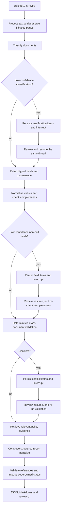
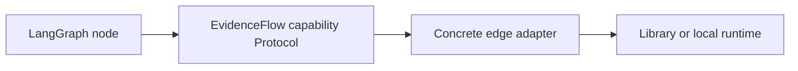

# EvidenceFlow

EvidenceFlow is a stateful enterprise document-review workflow that combines structured local-LLM extraction, field-level provenance, deterministic cross-document validation, policy RAG, and persistent human-in-the-loop review.

It reviews a synthetic company-onboarding package as a bounded workflow. It is not a chatbot, an autonomous agent, or a “chat with PDFs” application.

> [!IMPORTANT]
> EvidenceFlow V1 is a local portfolio/demo system for synthetic documents only. It has no authentication boundary and must not be exposed to the internet or used with customer, personal, regulated, or confidential data.

## Quick start

Prerequisites: macOS or Linux, [`uv`](https://docs.astral.sh/uv/), a running [Ollama](https://ollama.com/) service, and enough memory for `gemma4:12b-mlx`. Start the Ollama desktop app or run `ollama serve` in a separate terminal if it is not already running.

From the repository root:

```bash
# One-time local setup
uv python install 3.12.13
make setup
test -f .env || cp .env.example .env
ollama pull gemma4:12b-mlx
ollama pull embeddinggemma
make rebuild
```

For optional tracing, start `make mlflow` in another terminal now, before starting the application. Then:

```bash
# Start the API and frontend; this also runs the dependency doctor
make start
```

Open `http://127.0.0.1:8000/` and upload the three PDFs in `eval/bundles/bundle_001/documents/` for the happy path, or use `bundle_008` to exercise a registration-conflict review. Upload only the PDFs, not `ground_truth.json`.

With tracing enabled, open `http://127.0.0.1:5001/`. Node.js 22 is needed only for frontend tests, not to run the UI. See [Local setup](#local-setup) for model-alias overrides, MLflow usage, policy-index rebuild rules, and all development commands.

## What problem it solves

A business reviewer rarely receives one perfect source of truth. A package can contain an application form, an official company extract, a financial statement, optional correspondence, duplicated documents, missing evidence, and mutually inconsistent values.

EvidenceFlow answers one concrete question:

> What information was submitted, which required documents or fields are missing, where are the inconsistencies, and what still needs a human decision?

V1 accepts one to five digitally generated text PDFs and recognizes exactly these document types:

| Document type | Important extracted data |
| --- | --- |
| `application_form` | Company name, registration number, annual revenue in EUR, employee count |
| `company_extract` | Legal company name, registration number, incorporation date |
| `financial_statement` | Company name, annual revenue in EUR, reporting year, optional employee count |
| `supporting_correspondence` | Mentioned company name and relevant clarification statements |
| `unknown` | Preserved as submitted, but not treated as required business evidence |

A normal complete package contains an application form, company extract, and financial statement. Missing or incomplete evidence is reported; it is never silently inferred from another document.

## Workflow



The workflow may interrupt at classification, field, or conflict review. Original model output and source evidence remain unchanged; reviewer-approved, corrected, or selected values are stored as separate effective values with an audit decision. After a correction, deterministic checks run again before reporting.

### What a LangGraph node means here

A **LangGraph node** is one named step in this state machine: a synchronous or asynchronous Python function that reads the current `ReviewState` and returns only the state fields it changed. For example, `process_documents` returns processed pages, `extract_fields` returns typed extractions, and `compose_report` returns the final report. Edges choose which node runs next.

A node is not an autonomous agent and it is not a model. Some nodes call an injected capability such as `FieldExtractor`; others run deterministic Python such as completeness checks, cross-document validation, or review-decision application. Nodes do not instantiate/configure provider clients, manage credentials, or access business persistence directly; they invoke injected adapters when provider or index I/O is needed.

LangGraph supplies the orchestration mechanics around those functions: routing, checkpointing, interrupting for a reviewer, and resuming the same `thread_id`. The checkpoint database records durable graph state after steps, so a stopped process can continue the same workflow. LangChain sits lower in the stack as the Ollama chat/embedding integration used inside a few concrete capability adapters. EvidenceFlow's Pydantic domain models, YAML rules, and deterministic Python remain the source of truth.

## Architecture

### The boundary that matters most

> **LLMs interpret and explain. Deterministic code validates and decides.**

For example, a model may extract `employee_count = 42` from one page and `employee_count = 31` from another. Python—not the model—decides that those integers conflict. Likewise, Python checks required documents, normalizes company names and registration numbers, applies the configured revenue tolerance, derives report status, and rejects unsupported report references.

The reporting model receives a sealed `VerifiedReview` plus retrieved policy evidence. It can explain verified facts, but it cannot create findings or set the canonical company name/status. Every finding and policy ID in its structured narrative is checked against the supplied domain objects.

### Capability boundaries and dependency direction

The following names are Python [`Protocol`](app/ports.py) ports: small structural interfaces that describe what the application needs, not base classes, service locators, or separate network services. Runtime adapters are created once in the lifespan composition root, [`app/bootstrap.py`](app/bootstrap.py), and injected into the graph, API, or runner; indexing/evaluation commands compose the same ports separately. Workflow code therefore depends on provider-neutral capabilities while PyMuPDF, LangChain/Ollama, sqlite-vec, SQLite, and the filesystem stay at the edge.

| Capability | Input → output | V1 adapter and exact responsibility | Called from |
| --- | --- | --- | --- |
| `DocumentProcessor` | `UploadedDocument` → `ProcessedDocument` with ordered, one-based `PageContent` | `PyMuPDFDocumentProcessor` reads bytes through an opaque artifact ID, validates PDF structure/encryption/page and text limits, extracts text off the event loop, and never leaks PyMuPDF objects. It does not perform OCR. | `process_documents` graph node |
| `DocumentClassifier` | `ProcessedDocument` → proposed `DocumentClassification` | `LLMDocumentClassifier` uses schema-constrained Gemma/Ollama output to propose one of the five document types with confidence and reasoning. The later deterministic node—not this adapter—applies the `<0.70` review threshold and preserves any corrected effective type separately. | `classify_documents` graph node |
| `FieldExtractor` | `ProcessedDocument` + resolved `DocumentType` → typed `ExtractionResult` | `LLMFieldExtractor` uses a type-specific schema to return allowed fields, confidence, and exact one-based page evidence. It validates values and citations but does not normalize values, check completeness, or compare documents. `unknown` produces an empty typed extraction without a model call. | `extract_fields` graph node |
| `ReportComposer` | sealed `VerifiedReview` + `list[PolicyEvidence]` → validated `ReviewReport` | `LLMReportComposer` writes narrative content only: an executive summary and sections. Unknown finding/policy IDs are rejected, and deterministic `finalize_report` supplies the canonical company name/status and accepts only references present in the verified inputs. | `compose_report` graph node |
| `EmbeddingProvider` | policy/query text → finite, fixed-dimension vectors | `LangChainEmbeddingProvider` wraps `embeddinggemma`, maps provider failures to typed errors, and validates vector count, 768 dimensions, and finite values. It exposes no LangChain type at its public edge. | policy-index builder and `SqliteVecPolicyRetriever` |
| `PolicyRetriever` | query + limit → ranked `list[PolicyEvidence]` | `SqliteVecPolicyRetriever` validates the index/manifest identity, embeds the query, searches the pinned read-only sqlite-vec generation, and returns stable policy/section/evidence IDs, text, source path, and score. It supplies support for a finding; it does not decide the finding. | `retrieve_policy_evidence` graph node and evaluation |
| `ReviewRepository` | review IDs, snapshots, review items/decisions, reports, and jobs ↔ persisted business records | `SQLiteReviewRepository` owns the business review aggregate and durable single-worker queue, including migrations, atomic resume guards, immutable decisions, reports, audit events, and restart recovery. It is deliberately separate from LangGraph's checkpoint database. | FastAPI routes and `WorkflowRunner`; graph nodes do not access it |
| `ArtifactStore` | review/document IDs + bytes ↔ opaque artifact IDs | `LocalArtifactStore` stores uploads below a configured root with safe identifiers, path-containment checks, and atomic writes. It also implements an export-writing method, although current JSON/Markdown endpoints stream persisted report state directly. It keeps filesystem paths out of domain/API contracts and can later be replaced by object storage. | upload/evidence routes; `DocumentProcessor` reads through its narrower artifact-reader shape |

During one review, they collaborate in this order:

1. The upload route writes PDF bytes through `ArtifactStore`, creates the review/document rows and initial durable job through `ReviewRepository`, and returns `202 processing`.
2. `WorkflowRunner` claims that job and invokes the LangGraph thread. Its nodes call `DocumentProcessor`, then `DocumentClassifier`, then `FieldExtractor`; separate deterministic nodes decide whether to interrupt and what findings exist.
3. After validation, `PolicyRetriever` turns finding-derived queries into ranked policy evidence, using `EmbeddingProvider` for compatible query vectors.
4. `ReportComposer` receives only the sealed `VerifiedReview` and retrieved evidence. Deterministic code validates its references and imposes the canonical identity/status.
5. The runner persists snapshots, pending items, decisions, or the final report through `ReviewRepository`; the API polls those records/checkpoints and serves owned source PDFs through `ArtifactStore`.

The common dependency path is:



This is a ports-and-adapters use of dependency inversion. A future OCR processor, model provider, vector store, relational database, or object store can replace one adapter without moving business truth into graph routing or provider code. Model-free tests use fakes that satisfy the same method shapes.

### Per-task model configuration

[`config/models.yaml`](config/models.yaml) is a typed model registry. The checked-in local defaults are:

```yaml
models:
  classification:
    provider: ollama
    model: gemma4:12b-mlx
    temperature: 0.0
  extraction:
    provider: ollama
    model: gemma4:12b-mlx
    temperature: 0.0
  reporting:
    provider: ollama
    model: gemma4:12b-mlx
    temperature: 0.2
  embeddings:
    provider: ollama
    model: embeddinggemma
    dimensions: 768
```

The three chat tasks are independently overrideable with `EVIDENCEFLOW_CLASSIFICATION_MODEL`, `EVIDENCEFLOW_EXTRACTION_MODEL`, and `EVIDENCEFLOW_REPORTING_MODEL`. Embeddings use `EVIDENCEFLOW_EMBEDDING_MODEL`; all Ollama calls honor `OLLAMA_BASE_URL`.

Only Ollama adapters are implemented in V1. Selecting one of the typed future provider names produces a precise `UnsupportedProviderError`; there is no silent fallback. Chat capabilities use LangChain JSON-schema structured output, validate the result with Pydantic, and allow one bounded repair attempt.

### Provider responses stop at the domain boundary

Classification, extraction, and narrative responses are immediately converted to Pydantic domain models. Once data crosses into [`app/domain/`](app/domain/), the rest of the application does not need to know which provider or model produced it.

This provides runtime validation for:

- allowed document types and field names;
- typed values and confidence ranges;
- one-based page provenance for every non-null extracted value;
- conditional review-item and decision shapes;
- unique stable identifiers;
- report sections and their referenced finding/policy IDs.

### Replaceable document processing

`PyMuPDFDocumentProcessor` opens and extracts PDFs behind the `DocumentProcessor` protocol. Downstream capabilities receive a provider-neutral `ProcessedDocument` containing ordered `PageContent`; they never receive a `fitz.Document`.

V1 rejects corrupt, encrypted (including empty-user-password encryption), over-50-page, and effectively textless documents with typed errors. Blank pages are retained with their one-based provenance when the document as a whole contains useful text. OCR is not a hidden fallback. A future OCR or Document Intelligence processor can implement the same port without changing extraction or graph routing.

### Policy retrieval, not a leaked vector database

Application code asks a `PolicyRetriever` for policy evidence; it does not depend on a generic vector-store interface. The V1 `SqliteVecPolicyRetriever` searches six local Markdown policies and returns typed evidence with a stable ID, policy/section ID, text, score, and source path.

Policies provide evidence for the report. They are not the business-rules engine: [`config/review_rules.yaml`](config/review_rules.yaml) and deterministic Python remain authoritative.

The section-aware indexer creates evidence IDs such as `EFP-FINANCIAL:2.2:chunk-0`. The SQLite database embeds the canonical manifest: provider, embedding model/digest, 768 dimensions, preprocessing profile, chunk parameters, corpus hash, counts, build ID, and timestamp. An adjacent JSON file is a human-readable mirror that is repaired from that embedded manifest when missing or stale. Startup/search validates the database, corpus, counts, and configured embedder, and refuses an incompatible index with rebuild guidance.

Changing the reporting chat model does not invalidate this index. Changing `embeddinggemma`, its dimensions/digest, or the preprocessing profile generally does.

### Durable human review

Human review is a persisted workflow state, not an in-memory callback:

1. Low-confidence classifications (`< 0.70`), low-confidence non-null fields (`< 0.75`), or deterministic conflicts create typed review items.
2. LangGraph interrupts and its state is checkpointed under the review’s stable `thread_id`.
3. The API requires exactly one valid decision for every pending item in the current interrupt.
4. SQLite changes the review from `needs_review` to `processing` inside an immediate transaction; duplicate or concurrent resumes receive `409 Conflict`.
5. The same graph thread resumes, writes separate effective overrides/audit decisions, and re-runs validation.

The business repository also contains a small durable single-worker job queue. Work that was `running` during a process interruption is reclaimed on startup. This is suitable for a local demo; it is not a distributed production queue.

### One stateful graph, intentionally

V1 uses one graph because the task is bounded, sequential, and audit-sensitive. Multiple autonomous agents would add coordination, failure, and observability complexity without improving this review flow. Future capabilities can still be independently replaced through ports.

### A thin vanilla-JavaScript client

[`frontend/`](frontend/) uses semantic HTML, CSS, ES modules, `fetch`, and no build system. It implements four states:

1. drag/drop upload with selected-file management;
2. processing with 1.5-second polling, live summary counts, and an authoritative seven-stage completed/current/upcoming tracker projected from the persisted LangGraph checkpoint;
3. accessible classification/field/conflict review cards with source-PDF links;
4. structured report presentation with JSON/Markdown downloads.

The tracker uses the stable reviewer-facing sequence **Read PDFs → Classify → Extract fields → Check completeness → Cross-check evidence → Retrieve policy evidence → Compose report**. It is derived from the durable graph checkpoint rather than a timer or estimated percentage, so a long model call stays on its real stage until that work finishes.

The review ID is kept in the URL hash so a refresh restores the active review. Keyboard operation, focus management, stage-transition announcements, reduced-motion support, and high-contrast states are built in. Unchanged polls do not replace the tracker or repeat announcements. Confidence thresholds, conflicts, severity, and policy applicability never run in JavaScript—the API is the boundary. A future React client would not require a workflow rewrite.

#### Why V1 uses short polling

The browser currently schedules an ordinary `GET` 1.5 seconds after each response while a review is processing—roughly 40 requests per minute when responses are fast, which is acceptable for the small local V1 bundles. Durable state and the review ID in the URL hash let a manual retry or refresh restore the review after an app or browser restart. Each response is a fresh read of business state plus the latest LangGraph checkpoint; there is no estimated client-side progress.

Long polling is possible, but a correct implementation cannot wait only for the business `revision`: graph-node transitions advance the separate checkpoint ID without necessarily changing that revision. The robust design would send an opaque token combining both versions, suspend one request for roughly 20–25 seconds, notify a per-review `asyncio.Condition` only after checkpoint/business commits, return immediately on change, and let the frontend reconnect with one cancellable request. A timeout would return the current state as a heartbeat for missed notifications; bounded reconnect/backoff after a dropped request would recover an app restart.

V1 keeps short polling because the current cadence is acceptable for the checked-in small synthetic demos, while an event-driven conversion is cross-cutting. A loop inside FastAPI would merely move repeated SQLite reads server-side while holding a request open: at the same cadence it would not reduce database work, and at a tighter cadence it would increase it. A slimmer progress response or conditional request would be a smaller optimization to consider first. For a future multi-process or horizontally scaled deployment, checkpoint-aware long polling or server-sent events would both need a shared notification source rather than an in-process-only broker.

### Persistence and local observability

Runtime data is separated by purpose:

| Path | Responsibility |
| --- | --- |
| `data/evidenceflow.db` | Reviews, document metadata, pending items, immutable decisions, reports, audit events, and local jobs |
| `data/checkpoints.db` | LangGraph checkpoint/thread state |
| `data/policy_index.db` | sqlite-vec policy chunks and embeddings |
| `data/policy_index_manifest.json` | Human-readable mirror of the canonical manifest embedded in the index |
| `data/uploads/` | Review-owned source PDFs addressed by generated IDs; JSON/Markdown downloads are streamed from persisted review/report state |
| `data/mlflow.db` and `data/mlartifacts/` | Optional local MLflow tracking data |

MLflow sits behind a small tracer interface and records content-free workflow/capability spans. Runtime tracing is fail-open: if MLflow is unavailable, review execution continues and `/health` reports it as degraded. Evaluation latches any tracing failure and fails closed so a benchmark cannot be presented as fully observed when telemetry was lost. Spans record model/provider identity, correlation IDs, counts, latency, and token usage when Ollama supplies it. They do not record document text, prompts, or source excerpts. MLflow is used here for tracing and evaluation, not claimed as production model monitoring.

## Deterministic rules

[`config/review_rules.yaml`](config/review_rules.yaml) is validated into typed configuration. Exact-threshold confidence values pass; only values below a threshold interrupt.

| Rule | V1 behavior |
| --- | --- |
| Required documents | Application form, company extract, and financial statement |
| Required fields | Checked on every recognized document, including duplicate instances |
| Company name | Unicode NFKC, case-folding, whitespace/punctuation normalization, `&` → `and`, legal-form presentation normalization without discarding the suffix |
| Registration number | Uppercase alphanumeric representation with presentation separators removed; leading zeroes remain significant |
| Annual revenue | Non-negative EUR decimal; all pairs must be within a symmetric `≤ 2%` difference |
| Employee count | Non-negative integer; exact equality (`0` absolute tolerance) |
| Dates/year | ISO-normalized date and validated four-digit reporting year |
| Duplicates | Every submitted value participates; divergent duplicates produce one grouped field conflict |

Missing required documents/fields are high-severity findings. Report status is code-owned: missing required evidence yields `incomplete`; unresolved actionable findings yield `needs_follow_up`; otherwise it is `complete`.

## Provenance is first class

An extracted field carries its source rather than a detached value:

```json
{
  "field_id": "field-financial-revenue",
  "document_id": "document_7a4f...",
  "field_name": "annual_revenue_eur",
  "value": 2350000,
  "confidence": 0.97,
  "evidence": [
    {
      "document_id": "document_7a4f...",
      "page_number": 4,
      "source_text": "Revenue for 2025 amounted to EUR 2.35 million."
    }
  ]
}
```

Page numbers are one-based everywhere exposed to users. Findings retain the values, normalized values, documents, pages, and excerpts used by deterministic checks. Reviewers can open the owned source PDF at `#page=N`, and corrections never erase the original extraction.

## API and UI

FastAPI serves the JSON API and static frontend in one local process.

| Method | Endpoint | Behavior |
| --- | --- | --- |
| `GET` | `/health` | Liveness/readiness plus safe SQLite, index, Ollama, and MLflow states |
| `POST` | `/api/v1/reviews` | Upload multipart field `files`; returns `202 processing` |
| `GET` | `/api/v1/reviews/{review_id}` | Poll state, summary counts, and stable workflow-step progress without exposing internal graph node names |
| `POST` | `/api/v1/reviews/{review_id}/resume` | Atomically submit the complete pending decision batch |
| `GET` | `/api/v1/reviews/{review_id}/report` | Validated structured report after completion |
| `GET` | `/api/v1/reviews/{review_id}/export.json` | Auditable JSON export |
| `GET` | `/api/v1/reviews/{review_id}/export.md` | Human-readable Markdown export |
| `GET` | `/api/v1/reviews/{review_id}/documents/{document_id}` | Review-owned original PDF for evidence viewing |

Uploads are limited to five PDFs, 10 MiB per file, 25 MiB per bundle, and 50 pages per PDF by default. The upload boundary validates safe filenames, MIME/extension, `%PDF-` signatures, generated IDs, review ownership, and path containment; the processor then validates PDF structure, encryption, page count, and useful extractable text before any model call. Duplicate instances are preserved. Public errors use a safe `{ "error": { "code", "message", "details", "request_id" } }` envelope without stack traces.

Open the UI at `http://127.0.0.1:8000/` after local setup.

## Repository map

```text
app/
├── ai/             # Structured model adapters and task capabilities
├── api/            # FastAPI routes and public request schemas
├── domain/         # Provider-neutral Pydantic truth
├── documents/      # PyMuPDF processor boundary
├── evaluation/     # Scenario generator, metrics, and runner adapters
├── graph/          # LangGraph state, routing, interrupts, and resume
├── observability/  # MLflow/no-op tracing boundary
├── persistence/    # SQLite repository, migrations, jobs, artifacts
├── retrieval/      # Policy chunking, manifest, sqlite-vec search
└── review/         # Deterministic rules, decisions, report validation
config/              # Per-task model registry and review rules
frontend/            # Build-free HTML/CSS/ES-module UI
policies/            # Six versioned local policy documents
eval/                # Generated bundles, labelled queries, real run outputs
tests/               # Unit, integration, e2e, and opt-in Ollama tests
```

## Tech stack

| Layer | Technology |
| --- | --- |
| Runtime/package workflow | Python 3.12.13, uv, locked dependencies |
| HTTP and contracts | FastAPI, Pydantic, pydantic-settings |
| Workflow | LangGraph with SQLite checkpointing |
| AI integration | LangChain, `langchain-ollama`, local Ollama |
| Chat and embedding models | `gemma4:12b-mlx`, `embeddinggemma` (768 dimensions) |
| PDF processing/generation | PyMuPDF, ReportLab |
| Business persistence | SQLite, aiosqlite, local filesystem artifacts |
| Policy retrieval | sqlite-vec with an embedding compatibility manifest |
| Tracing/evaluation | MLflow and the typed `app/evaluation` runner |
| Frontend | Vanilla JavaScript ES modules, HTML, CSS |
| Quality | pytest, pytest-asyncio, mypy strict mode, Ruff, GitHub Actions |

Docker is not part of this V1 implementation; containerization is explicitly deferred rather than represented as a completed capability.

## Local setup

### Prerequisites

- macOS or Linux;
- [`uv`](https://docs.astral.sh/uv/) for the pinned Python/dependency workflow;
- Node.js 22 for the build-free frontend tests (there are no frontend packages to install);
- [Ollama](https://ollama.com/) running locally;
- sufficient memory for the configured `gemma4:12b-mlx` model.

Docker is intentionally deferred. There is no Dockerfile or Compose configuration in V1; the local `uv`/Ollama path below is the supported setup.

### First-time order

From a fresh clone, use this order. Commands marked “separate terminal” stay running:

```bash
# Terminal 1: install the locked environment and prepare local settings
uv python install 3.12.13
make setup
cp .env.example .env

# Terminal 2: start Ollama (skip this if its service is already running)
ollama serve

# Back in Terminal 1: install the exact configured models
ollama pull gemma4:12b-mlx
ollama pull embeddinggemma

# Terminal 3: start optional runtime tracing (required for evaluation)
make mlflow

# Back in Terminal 1: create the ignored local policy index, verify readiness,
# and start the API plus frontend
make rebuild
make doctor
make start
```

`make start` runs `make doctor` itself, so the explicit doctor call above is useful as a readable diagnosis rather than a requirement. The doctor fails on critical Ollama model/digest or policy-index problems. An unavailable MLflow server is a warning for ordinary reviews because runtime tracing is fail-open; it becomes an error when running the evaluation.

### 1. Install the exact Python environment

```bash
uv python install 3.12.13
make setup
cp .env.example .env
```

`make setup` runs `uv sync --locked --all-extras --dev`. `uv.lock` is committed, so setup fails instead of silently changing the resolved environment.

### 2. Start Ollama and make the configured models available

If Ollama is not already running as a service:

```bash
ollama serve
```

In another terminal:

```bash
ollama pull gemma4:12b-mlx
ollama pull embeddinggemma
ollama list
```

Model aliases vary across local registries/platforms. If `gemma4:12b-mlx` is not available under that exact name, install a schema-capable local Gemma model and set all three `EVIDENCEFLOW_*_MODEL` overrides in `.env`. Run `make smoke` before using the app; alternative chat models must satisfy the same JSON-schema contracts. An embedding-model change also requires updating its configured dimensions/digest and rebuilding the policy index.

### 3. Start local MLflow (recommended)

```bash
uv run mlflow server \
  --host 127.0.0.1 \
  --port 5001 \
  --backend-store-uri sqlite:///data/mlflow.db \
  --default-artifact-root ./data/mlartifacts
```

The equivalent shortcut is `make mlflow`. MLflow is available at `http://127.0.0.1:5001`. EvidenceFlow deliberately avoids port 5000 because macOS AirPlay Receiver commonly reserves it. If this repository was already configured, update an existing `.env` that still points `MLFLOW_TRACKING_URI` at port 5000. To run without MLflow temporarily, set `EVIDENCEFLOW_MLFLOW_ENABLED=false`; the workflow remains functional but tracing is disabled.

For a custom port, keep the server and application settings aligned—for example, set `MLFLOW_TRACKING_URI=http://127.0.0.1:5100` in `.env` and run `make mlflow MLFLOW_PORT=5100`. The frontend's convenience link targets the checked-in port 5001; open a custom URL manually.

To inspect a review, open the `evidenceflow` experiment and select **Traces**. A normal execution has a `workflow.execute` root span with task spans such as `document.process`, `ai.classification`, `ai.extraction`, `policy.retrieve`, and `ai.report`. Attributes and outputs show task/model identity, review correlation IDs, counts, latency, and any provider-reported token usage without copying PDF text or prompts into MLflow.

The real benchmark uses the separate `evidenceflow-evaluation` experiment. Its runs and per-bundle traces are only complete when the evaluation command succeeds; evaluation deliberately stops if MLflow becomes unavailable.

### 4. Build the policy index

Ollama and `embeddinggemma` must be available:

```bash
make rebuild
```

This is required after every fresh clone because the generated index and its manifest mirror are intentionally ignored by Git. Run it again after changing any file in `policies/`, the embedding model/digest or dimensions in `config/models.yaml`, or the chunking/preprocessing profile. Changes to deterministic rules or the reporting chat model alone do not invalidate the index. Rebuilding validates and flushes a complete temporary database before one atomic replacement. Existing readers stay pinned to the generation they validated; failures before that commit preserve the old database, and a missing or stale JSON mirror is safely regenerated from the canonical embedded manifest.

The index is a local sqlite-vec search structure over section-aware chunks from the six Markdown policies. At report time, deterministic findings become retrieval queries; the returned chunks provide traceable policy evidence for the narrative. The index does not decide whether values conflict and is not a replacement for `config/review_rules.yaml`.

### 5. Start EvidenceFlow

```bash
make start
```

Then open `http://127.0.0.1:8000/`. A quick dependency check is:

```bash
curl --fail http://127.0.0.1:8000/health
```

The application applies SQLite migrations and starts its local workflow worker during lifespan startup. Keep it bound to loopback; V1 has no authentication.

### Try the frontend with checked-in PDFs

Open `http://127.0.0.1:8000/`, then drag every PDF from one bundle's `documents/` directory into the upload area. Do not upload `ground_truth.json`; it is an evaluator label, not review evidence. These are useful demonstrations:

| Sample documents | What the reviewer should see |
| --- | --- |
| `eval/bundles/bundle_001/documents/*.pdf` | Complete, internally consistent happy path |
| `eval/bundles/bundle_005/documents/*.pdf` | Missing financial statement and an `incomplete` result |
| `eval/bundles/bundle_008/documents/*.pdf` | Conflicting registration numbers requiring a decision |
| `eval/bundles/bundle_011/documents/*.pdf` | Revenue values outside the symmetric 2% tolerance |
| `eval/bundles/bundle_014/documents/*.pdf` | Company-name formatting variants that normalize to agreement |
| `eval/bundles/bundle_016/documents/*.pdf` | Ambiguous employee count routed to field review |
| `eval/bundles/bundle_017/documents/*.pdf` | Ambiguous attachment routed to classification review |
| `eval/bundles/bundle_018/documents/*.pdf` | Complete package plus an irrelevant `unknown` document |
| `eval/bundles/bundle_019/documents/*.pdf` | Recognized but incomplete financial statement |
| `eval/bundles/bundle_020/documents/*.pdf` | Typed human correction before validation completes |

The other numbered bundles are deterministic variants of the same scenario families. For an interactive review, keep the app page open while it polls; the tracker distinguishes finished work, the active stage, and what comes next. When it pauses, inspect the evidence link (which opens the owned PDF at the cited page), submit one decision for every pending card, and continue until the structured report appears. Finally, inspect the findings and policy citations and download both JSON and Markdown exports. The URL hash retains the review ID, so refreshing or sharing that local URL restores the same persisted review on that machine.

The policy citations explain which local policy sections apply to verified findings; they are not model-generated authorities. The report status, normalized values, conflict findings, and accepted reference IDs remain code-owned even though Gemma writes the narrative.

### Environment overrides

The documented defaults are in [`.env.example`](.env.example). Common overrides are:

```dotenv
OLLAMA_BASE_URL=http://127.0.0.1:11434
EVIDENCEFLOW_CLASSIFICATION_MODEL=gemma4:12b-mlx
EVIDENCEFLOW_EXTRACTION_MODEL=gemma4:12b-mlx
EVIDENCEFLOW_REPORTING_MODEL=gemma4:12b-mlx
EVIDENCEFLOW_EMBEDDING_MODEL=embeddinggemma
EVIDENCEFLOW_DATA_DIR=data
EVIDENCEFLOW_MLFLOW_ENABLED=true
MLFLOW_TRACKING_URI=http://127.0.0.1:5001
```

### Make command reference

Run `make` or `make help` to see the same list locally.

| Command | When to use it |
| --- | --- |
| `make setup` | First clone or whenever `uv.lock` changes |
| `make doctor` | Before a demo, or when startup/model/index readiness is unclear |
| `make mlflow` | Start local tracing; required while evaluating |
| `make rebuild` | Fresh clone or after policy/embedding/index-profile changes |
| `make start` | Start the API and frontend after critical readiness checks |
| `make generate-data` | Deliberately regenerate all 20 deterministic sample bundles |
| `make evaluate` | Run the genuine 20-bundle local-model benchmark |
| `make smoke` | Quickly exercise classification, extraction, reporting, and embeddings against Ollama |
| `make test-ollama` | Run opt-in adapter tests plus a complete real-model LangGraph review of `bundle_001` |
| `make test` | Run all model-free Python and frontend tests |
| `make lint`, `make typecheck` | Run an individual static quality gate |
| `make check` | Run the same complete model-free gate expected by CI |

## Evaluation

The deterministic ReportLab generator uses the same immutable scenario definitions for PDF contents and `ground_truth.json`, preventing fixture/label drift. It produces exactly 20 bundles:

Each bundle is one independent company-review case. Model context is not shared between bundles, and EvidenceFlow does not maintain a chat transcript: every classification/extraction call receives one current document, and reporting receives only the verified state and retrieved evidence for the current bundle. A model's context window is therefore fresh for each call; running bundle 20 after bundle 1 does not accumulate the previous 19 bundles or progressively degrade from context growth.

For each case, the evaluator processes its PDFs, follows the same LangGraph routing as the application, applies labelled reviewer decisions when an interrupt is expected, and compares the prediction with that bundle's `ground_truth.json`. It also evaluates policy retrieval against the separately labelled queries in `eval/queries/policy_relevance.json`. Ground truth is never included in model prompts.

| Scenario family | Bundles |
| --- | ---: |
| Complete, consistent packages | 4 |
| Missing required document | 3 |
| Registration-number conflict | 3 |
| Revenue conflict outside tolerance | 3 |
| Company-name formatting variant that should normalize | 2 |
| Low-confidence/ambiguous classification or extraction | 2 |
| Unknown/irrelevant document | 1 |
| Incomplete financial statement | 1 |
| Human correction before validation passes | 1 |
| **Total** | **20** |

Generate the corpus with:

```bash
make generate-data
```

This command replaces the checked-in generated corpus. The explicit equivalent is `uv run python -m app.cli generate-eval-data --output-dir eval/bundles --overwrite`.

The evaluator records dataset/config/model identity and measures:

- document-classification accuracy;
- typed field-extraction accuracy;
- missing-document detection accuracy;
- conflict precision, recall, and F1;
- human-review routing accuracy;
- policy HitRate, Recall, MRR, and nDCG at 5 over [`eval/queries/policy_relevance.json`](eval/queries/policy_relevance.json);
- report citation validity and unknown-ID rate;
- per-bundle and total latency/counts.

Run the real local-model evaluation and write machine-readable plus Markdown output with:

```bash
make evaluate
```

Keep MLflow running throughout. The explicit equivalent is `uv run python -m app.cli evaluate --bundles-dir eval/bundles --output-dir eval/results`.

### Generated results

The genuine local run completed at `2026-07-14T23:11:16Z` with `gemma4:12b-mlx` for classification, extraction, and reporting and `embeddinggemma` for retrieval. It evaluated all 20 bundles / 64 PDFs from fresh model calls (`cache_hit_count: 0`) in 3,971.48 seconds. These values are copied from the committed [JSON result](eval/results/evaluation-results.json) and [generated Markdown result](eval/results/evaluation-results.md), not estimated or hand-written.

Those artifacts identify the exact evaluated implementation by hash. Later UI, API, documentation, or local operational-default changes do not retroactively alter the recorded run; run `make evaluate` again before presenting the metrics as measurements of a newer implementation hash.

| Metric | Measured result |
| --- | ---: |
| Document classification accuracy | 1.0000 |
| Field extraction accuracy | 0.9953 |
| Missing-document detection accuracy | 1.0000 |
| Conflict precision / recall / F1 | 1.0000 / 1.0000 / 1.0000 |
| Exact review-routing accuracy | 0.8500 |
| Binary review-required accuracy | 0.8500 |
| Report citation validity / unknown-ID rate | 1.0000 / 0.0000 |
| Policy HitRate / Recall / MRR / nDCG at 5 | 1.0000 / 0.7500 / 0.8750 / 0.7246 |
| Mean bundle latency (minimum–maximum) | 198.52s (160.92–292.26s) |

The three review-routing misses are the labelled low-confidence/correction cases `bundle_016`, `bundle_017`, and `bundle_020`; the real model did not request their expected pauses. This is retained as a measured model-quality limitation rather than corrected in the result artifacts. Classification was 64/64, extraction was measured over 215 labelled fields, all six labelled conflicts were found without a false positive, and all 75 report references were valid.

| Reproducibility identity | SHA-256 / digest |
| --- | --- |
| Gemma model | `197a75677efb4b634352a8bdf24fd4781f1ea2c0b0c11f2b391ea7e0fcdcf01c` |
| EmbeddingGemma model | `85462619ee721b466c5927d109d4cb765861907d5417b9109caebc4e614679f1` |
| Dataset | `4d2dbef7a5821d12e178c5387c196eb4f58da05de4e71fa4b6f4affc1c6e47d9` |
| Configuration | `556991efbcec38c779fb2a1f53ef04938fbcc8c11f14a3dd676e203c630ac728` |
| Implementation | `473de267f8a8cf8d6003cff3cb8e8d0525d4f1964592a47dbd8ca18ca8ca5d69` |
| Policy-query labels | `d397b93bb60c66f1f0f6d557310885d9d29aba611ca58c42c2fd3acee74cddb8` |

Deterministic rule correctness is covered separately by model-free unit tests. In particular, tests require zero accepted unknown finding IDs, zero accepted unknown policy-evidence IDs, and no completed report whose deterministic status/references are corrupt.

## Development and verification

The complete model-free gate used locally and by CI is:

```bash
make check
```

It expands to:

```bash
uv lock --check
uv sync --locked --all-extras --dev
uv run ruff check .
uv run mypy app
uv run pytest -m "not ollama"
npm test
```

Before an interactive demo, `make doctor` checks the configured Ollama model names/digests and policy-index compatibility, while reporting unavailable MLflow as a non-critical runtime warning.

The quick configured-model smoke exercises schema-constrained classification, extraction, reporting, and 768-dimensional embeddings:

```bash
make smoke
```

For the heavier opt-in suite, including a complete real-model LangGraph review of the consistent sample bundle:

```bash
make test-ollama
```

Tests cover normalization and tolerance boundaries, completeness, duplicates, provenance, review-decision validation, report-reference rejection, text-PDF limitations, frontend evidence/duplicate-upload helpers, policy chunking/index compatibility, persistence/concurrency, graph interrupt/resume behavior, API ownership/errors, exports, and deterministic fake-capability end-to-end flows. CI never requires a local model.

## Security and data handling

- Use synthetic data only; see [`SECURITY.md`](SECURITY.md).
- Original filenames are sanitized and never used as storage paths.
- Uploads receive generated review/document/artifact IDs and are served only through review-scoped ownership checks.
- PDF extension, MIME type, signature, size, page count, encryption, structural validity, and useful text are checked.
- Runtime databases, uploads, exports, policy indexes, MLflow artifacts, `.env`, secrets, and model weights are ignored by Git.
- MLflow spans contain operational metadata and safe summaries, not document text, prompts, or source excerpts.
- Safe error envelopes reach the client; detailed exception context remains server-side.

## V1 limitations

- synthetic, local business-onboarding documents only;
- digitally generated text PDFs only—no OCR, handwriting, or scanned-document support;
- Ollama runtime adapters only—no OpenAI, Azure OpenAI, or other cloud provider implementation;
- one local FastAPI process and durable single-worker SQLite queue, not distributed execution;
- SQLite/local filesystem persistence, not multi-user or horizontally scalable storage;
- no production authentication, authorization, tenancy, encryption/key-management, retention tooling, or internet deployment boundary;
- no WebSockets, collaborative review, chat interface, or autonomous/multi-agent workflow;
- MLflow workflow tracing/evaluation, not production model monitoring;
- no Docker/container implementation in the current scope.

## Possible future extensions

These are architectural seams, not implemented features:

- OCR or multimodal processors behind `DocumentProcessor`;
- Azure Document Intelligence for processing;
- Azure AI Search, Qdrant, or pgvector behind `PolicyRetriever`;
- cloud/task-specific chat and embedding providers;
- PostgreSQL and object storage;
- a distributed job system and production authentication/tenancy;
- more document types and versioned policy/rule sets;
- checkpoint-aware long polling or server-sent progress events backed by a shared notification source;
- a React or other compiled frontend consuming the same API.

## License

EvidenceFlow is licensed under [AGPL-3.0-only](LICENSE). This matches the open-source licensing path for the required PyMuPDF dependency; see [`THIRD_PARTY_NOTICES.md`](THIRD_PARTY_NOTICES.md). Local model weights are not redistributed by this repository and remain subject to their own licenses.
