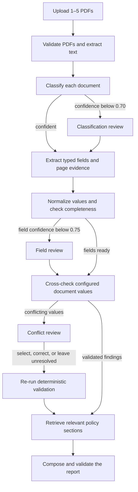

# EvidenceFlow

EvidenceFlow is a local document-review workflow for synthetic company-onboarding packages. It combines structured local-LLM extraction, page-level provenance, deterministic validation, policy retrieval, persistent human review, and a browser-based reviewer interface.

It is deliberately not a chatbot or an autonomous-agent demo. The models interpret documents and write narrative; deterministic code owns validation, findings, and final status.

> [!IMPORTANT]
> EvidenceFlow V1 is a local portfolio system for synthetic documents only. It has no authentication boundary. Do not expose it to the internet or use it with personal, customer, regulated, confidential, or otherwise sensitive data.

## Quick start

You need macOS or Linux, [uv](https://docs.astral.sh/uv/), a running [Ollama](https://ollama.com/) service, and enough memory for `gemma4:12b-mlx`.

From the repository root:

```bash
uv python install 3.12.13
make setup
test -f .env || cp .env.example .env

ollama pull gemma4:12b-mlx
ollama pull embeddinggemma

# Required on a fresh clone and after policy/embedding changes
make rebuild
```

For optional local tracing, start MLflow in a separate terminal before the application:

```bash
make mlflow
```

Then, from the original terminal:

```bash
# Validates the models and policy index, then starts the API and UI
make start
```

Open [http://127.0.0.1:8000](http://127.0.0.1:8000) and upload the three PDFs from `eval/bundles/bundle_001/documents/`. If tracing is running, MLflow is available at [http://127.0.0.1:5001](http://127.0.0.1:5001). Detailed setup and troubleshooting are in [Local development](docs/local-development.md).

## What EvidenceFlow reviews

A reviewer rarely receives one perfect source of truth. A package may contain an application, an official registry extract, a financial statement, supporting correspondence, duplicate documents, missing fields, and contradictory values.

EvidenceFlow answers:

> What was submitted, which required evidence is missing, where do documents disagree, what policies are relevant, and what still needs a human decision?

V1 accepts one to five digitally generated text PDFs and recognizes exactly five document types:

| Document type | Role and important fields |
| --- | --- |
| `application_form` | Submitted company name, registration number, annual revenue, and employee count |
| `company_extract` | Official legal name, registration number, and incorporation date |
| `financial_statement` | Company name, annual revenue, reporting year, and optional employee count |
| `supporting_correspondence` | Relevant company mentions and clarification statements |
| `unknown` | Preserved as submitted, but never treated as required business evidence |

The application form represents what the applicant submitted. The company extract represents independent registry evidence used to check the legal name and registration number. EvidenceFlow does not fetch a real registry: in this synthetic V1, the deterministic corpus generator creates both PDFs so their agreement and conflicts can be tested safely.

A normal complete package contains an application form, company extract, and financial statement. Missing evidence is reported; it is never silently borrowed from another document.

## How it works

### One review, from upload to report



Here is the same flow in plain language:

1. **Accept and persist the package.** FastAPI validates the upload boundary, stores each PDF under generated identifiers, creates a review with a stable `review_id` and `thread_id`, and places a job in the durable local queue.
2. **Read the PDFs.** PyMuPDF validates document structure, encryption, page limits, and useful text. It produces ordered pages with one-based page numbers. Scanned or effectively textless PDFs fail with an explicit V1 limitation instead of silently invoking OCR.
3. **Classify each document.** Gemma proposes one of the five supported types, a confidence score, and reasoning. If confidence is below `0.70`, the workflow saves a classification-review item and pauses.
4. **Extract typed fields.** Once the effective document type is known, Gemma returns only the fields allowed for that type. Every non-null field includes confidence and source-page evidence. A non-null field with confidence below `0.75` creates a field-review item.
5. **Normalize and validate in code.** Python canonicalizes names and registration numbers, checks every required document and field, and compares every eligible value under the configured cross-document rules—including duplicates. This step does not ask the model whether two values conflict.
6. **Resolve conflicts when necessary.** A reviewer can select one cited value, enter a typed correction, or mark the conflict unresolved. The original model values and citations remain unchanged.
7. **Retrieve policy evidence.** Code creates one baseline query plus finding-specific queries over six local Markdown policies. The retriever returns ranked chunks with stable evidence, policy, and section IDs. Policy retrieval supports a finding; it never creates or decides one.
8. **Compose a constrained report.** Gemma writes the executive summary and narrative sections from a sealed verified state. Code supplies the canonical company name and status, and rejects any finding or policy reference not present in the verified inputs.

The review state preserves field/page provenance and reviewer actions, while report sections may reference only findings and policy evidence supplied in the verified inputs.

### What is a LangGraph node?

A LangGraph node is simply one named state transition in the workflow. It is a synchronous or asynchronous Python function that reads the current `ReviewState` and returns only the fields it changed.

For example:

- `process_documents` returns processed pages;
- `classify_documents` returns proposed classifications;
- `cross_check` returns deterministic findings;
- `compose_report` returns the validated report.

A node is not a model and it is not an autonomous agent. Some nodes call an injected capability such as `FieldExtractor`; other nodes run ordinary deterministic Python. LangGraph provides routing, checkpointing, interrupts, and `Command(resume=...)` continuation on the same `thread_id`. LangChain is used lower in the stack to connect the Ollama chat and embedding models to the provider adapters.

V1 intentionally uses one stateful graph. The review is bounded, sequential, and audit-sensitive, so multiple autonomous agents would add coordination without improving the business flow.

### Who is responsible for each decision?

| Actor | Owns | Does not own |
| --- | --- | --- |
| Local Gemma models | Proposed document type, typed field extraction, confidence, source citations/evidence spans, report narrative | Required-document rules, normalization, conflicts, severity, canonical status |
| Deterministic Python | File and provenance validation, confidence thresholds, normalization, completeness, comparisons, findings, reference validation, report status | Interpreting unstructured prose or writing narrative |
| Policy retriever | Ranked policy-evidence chunks for code-derived queries | Deciding whether a finding exists |
| Human reviewer | Approving/correcting low-confidence output, selecting a conflict value, or leaving it unresolved | Mutating the original model output or bypassing validation |

This separation is the main architectural rule:

> **Models interpret and explain. Deterministic code validates and decides.**

### What happens after a human correction?

The original extraction and its provenance are preserved unchanged. EvidenceFlow stores a separate, append-only audit decision and derives an effective value used by later validation.

```text
original model field + source citation
                 │
                 ├── reviewer decision (immutable audit record)
                 │
                 └── effective value used for revalidation
```

The API requires exactly one valid decision for every item in the current interrupt. An atomic transition changes the review from `needs_review` back to `processing`; repeated or concurrent resume attempts receive `409 Conflict`. LangGraph resumes the same thread, and the deterministic checks run again before reporting.

### How policy queries and embeddings work

A policy query is a short, plain-English search sentence created after validation by the deterministic [`_policy_queries`](app/graph/workflow.py) helper. It is not written by the chat model or entered by the reviewer, and it does not decide whether a finding exists. Its only purpose is to find relevant passages in the local policy corpus.

Every review starts with this baseline query:

```text
required onboarding documents, reliable evidence, and manual review requirements
```

Code then adds one query for each finding, using fixed templates:

| Finding | Query template |
| --- | --- |
| Missing document | `required document missing {document_type} onboarding evidence` |
| Missing required field | `incomplete {document_type} missing {field_name}` |
| Conflicting field | `conflicting {field_name} evidence and manual review resolution` |

For example, a registration-number conflict produces two queries:

```text
required onboarding documents, reliable evidence, and manual review requirements
conflicting registration_number evidence and manual review resolution
```

Policy retrieval uses the embedder in two related phases:

```text
Policy-index build (`make rebuild`)
policy Markdown → section-aware chunks → embeddinggemma → stored 768-dimensional vectors

Review execution
baseline/finding query → embeddinggemma → 768-dimensional query vector
                                           ↓
                              sqlite-vec cosine search
                                           ↓
                              ranked policy-evidence chunks
                                           ↓
                                  constrained report input
```

At index-build time, [`PolicyIndexBuilder`](app/retrieval/index.py) uses `embeddinggemma` to embed the policy chunks. During a review, [`LangChainEmbeddingProvider`](app/ai/models/embedding.py) converts each query into the same vector space, and [`SqliteVecPolicyRetriever`](app/retrieval/sqlite_vec.py) performs the search. sqlite-vec returns the three nearest chunks per query; EvidenceFlow removes duplicate evidence IDs, keeps the best score for each chunk, and supplies at most eight chunks to `ReportComposer`.

The returned `PolicyEvidence` contains a stable evidence ID, policy ID, section ID, text, source path, and similarity score. Gemma may cite those evidence IDs in its narrative, but deterministic code rejects references that were not retrieved. Even a review with no findings runs the baseline query so the report can receive general onboarding and manual-review policy context.

This is why `embeddinggemma` must be available both when rebuilding the index and while reviews are running. Query vectors are comparable with stored policy vectors only when the embedding model and dimensions match; changing that identity requires `make rebuild`.

## Architecture

### Capability boundaries

The names below are Python [`Protocol`](app/ports.py) interfaces. They describe what the application needs without tying workflow code to PyMuPDF, Ollama, sqlite-vec, SQLite, or the filesystem. [`app/bootstrap.py`](app/bootstrap.py) constructs the concrete adapters once and injects them into the graph, runner, and API.

| Capability | Plain-language responsibility | V1 implementation |
| --- | --- | --- |
| `DocumentProcessor` | Turn an owned PDF into validated, ordered page text with one-based provenance | PyMuPDF |
| `DocumentClassifier` | Propose one supported document type with confidence | Gemma through Ollama structured output |
| `FieldExtractor` | Extract the type-specific fields, confidence, and source evidence | Gemma through Ollama structured output |
| `ReportComposer` | Write narrative from verified facts and policy evidence | Gemma, followed by deterministic reference/status validation |
| `EmbeddingProvider` | Convert policy/query text into validated 768-dimensional vectors | `embeddinggemma` |
| `PolicyRetriever` | Return ranked, typed policy evidence for a query | sqlite-vec over the local policy corpus |
| `ReviewRepository` | Persist reviews, jobs, snapshots, review items, decisions, audit events, and reports | SQLite |
| `ArtifactStore` | Store and retrieve uploads through opaque, path-safe identifiers | Local filesystem |

This ports-and-adapters shape keeps provider types at the edge. Domain data is validated into Pydantic models immediately, so deterministic review code does not need to know which model or library produced it. Model-free tests replace these capabilities with fakes that satisfy the same method shapes.

For the exact inputs, outputs, adapter guarantees, and call sites, see [Architecture reference](docs/architecture.md).

### Models and policy retrieval

[`config/models.yaml`](config/models.yaml) configures each task independently:

| Task | Default model | Important setting |
| --- | --- | --- |
| Classification | `gemma4:12b-mlx` | temperature `0.0` |
| Extraction | `gemma4:12b-mlx` | temperature `0.0` |
| Reporting | `gemma4:12b-mlx` | temperature `0.2` |
| Embeddings | `embeddinggemma` | 768 dimensions |

The three chat adapters use explicit JSON-schema output, Pydantic validation, and one bounded repair attempt. Their model aliases are independently overrideable in `.env`.

The policy index is a generated sqlite-vec database over section-aware chunks from [`policies/`](policies/). Its compatibility manifest records the embedding identity, dimensions, preprocessing/chunking settings, and corpus hash. Run `make rebuild`:

- after every fresh clone;
- after changing a policy document;
- after changing the embedding model, digest, or dimensions;
- after changing policy preprocessing or chunking.

Changing the reporting model or deterministic review rules alone does not invalidate the index.

### Durable state and recovery

Three SQLite databases have separate responsibilities:

| Store | Responsibility |
| --- | --- |
| `data/evidenceflow.db` | Business review, documents, queue, pending items, decisions, reports, and audit events |
| `data/checkpoints.db` | LangGraph state and interrupt/resume checkpoints |
| `data/policy_index.db` | Policy chunks, vectors, and canonical index manifest |

Uploads live below `data/uploads/` under generated review/document IDs. MLflow uses its own local database and artifact directory.

The single-worker queue can reclaim work that was running when the process stopped. LangGraph continues from persisted checkpoints rather than reconstructing an in-memory callback. This is durable enough for a local demo, but it is not a distributed production queue.

### Frontend progress and observability

The build-free frontend uses semantic HTML, CSS, JavaScript modules, and `fetch`. It has four states: upload, processing, human review, and final report.

While processing, the client polls every 1.5 seconds. The completed/current/upcoming timeline is projected from the latest durable LangGraph checkpoint, not from a timer or estimated percentage. Long-running model calls therefore remain on their current workflow stage. Checkpoint-aware long polling or server-sent events are possible future transports, but are outside V1.

MLflow records content-free workflow and capability spans. Runtime tracing is fail-open so a temporary MLflow outage does not stop a review; evaluation tracing is fail-closed so an incompletely observed benchmark cannot be presented as complete. PDF text, prompts, and source excerpts are not logged by default.

## Deterministic rules and provenance

[`config/review_rules.yaml`](config/review_rules.yaml) is validated into typed configuration.

| Rule | V1 behavior |
| --- | --- |
| Required documents | Application form, company extract, and financial statement |
| Required fields | Checked on every recognized document, including duplicate instances |
| Classification review | Confidence below `0.70` |
| Field review | Non-null field confidence below `0.75` |
| Company name | Unicode/case/spacing/punctuation normalization while retaining legal-form meaning |
| Registration number | Uppercase alphanumeric canonical form; leading zeroes remain significant |
| Annual revenue | Decimal comparison using a symmetric `≤ 2%` relative difference |
| Employee count | Exact integer equality |
| Duplicates | Every eligible value participates in its configured comparison; agreement is harmless and divergence forms one grouped conflict |

Missing required documents and incomplete recognized documents produce high-severity findings. Final report status is code-owned:

- `incomplete` when required material is missing;
- `needs_follow_up` when actionable findings remain unresolved;
- `complete` otherwise.

Every non-null field carries source evidence:

```json
{
  "field_name": "annual_revenue_eur",
  "value": 2350000,
  "confidence": 0.97,
  "evidence": [{
    "document_id": "document_7a4f...",
    "page_number": 4,
    "source_text": "Revenue for 2025 amounted to EUR 2.35 million."
  }]
}
```

Page numbers are one-based everywhere exposed to users. Conflict findings retain the cited fields and normalized values used by comparison, and the UI opens the owned source PDF at the relevant page.

## Try the application

Open [http://127.0.0.1:8000](http://127.0.0.1:8000), select every PDF inside one bundle's `documents/` directory, and start the review. Do not upload `ground_truth.json`; it is an evaluator label, not review evidence.

| Bundle | Useful demonstration |
| --- | --- |
| `bundle_001` | Complete, consistent happy path |
| `bundle_005` | Missing financial statement and an `incomplete` result |
| `bundle_008` | Reliable registration-number conflict; select a value, enter a correction, or leave it unresolved |
| `bundle_011` | Revenue values outside the symmetric 2% tolerance |
| `bundle_014` | Company-name presentation variants that normalize to agreement |
| `bundle_018` | Complete package plus an irrelevant `unknown` document |
| `bundle_019` | Recognized but incomplete financial statement |

During a review:

1. Watch the progress page show completed, active, and upcoming stages.
2. When the graph pauses, open the cited PDF page and decide every pending item.
3. Continue until the structured report appears.
4. Inspect findings and policy citations, then download the JSON and Markdown exports.
5. If MLflow is running, open the `evidenceflow` experiment and inspect the root `workflow.execute` trace and its document/model/retrieval/report spans.

The review ID is stored in the URL hash. Refreshing the page restores the same persisted local review.

The full sample matrix, model-alias guidance, MLflow instructions, and troubleshooting are in [Local development](docs/local-development.md).

## Evaluation

The checked-in benchmark contains 20 deterministic synthetic company-review bundles. Each bundle is an independent case with generated PDFs and a `ground_truth.json` file derived from the same immutable scenario definition.

Contexts do not accumulate across bundles. Classification and extraction receive one current document per call; reporting receives only the verified state and retrieved evidence for the current bundle. Bundle 20 therefore does not inherit a transcript or context from bundles 1–19. Expected classification, extraction, finding, and routing labels are not supplied to those model calls. At an actual interrupt, a labelled decision simulates reviewer input and legitimately becomes part of the later verified review.

The evaluator follows the same LangGraph routing as the application, applies labelled reviewer decisions when the workflow actually interrupts, and compares predictions with ground truth. Expected-but-missed pauses are scored as routing misses rather than forced into the graph. Policy retrieval is evaluated against separately labelled queries.

Run it with MLflow available:

```bash
make evaluate
```

### Recorded local-model results

The genuine recorded run used `gemma4:12b-mlx` for classification, extraction, and reporting, and `embeddinggemma` for retrieval. These values come from the committed [JSON](eval/results/evaluation-results.json) and [Markdown](eval/results/evaluation-results.md) artifacts.

| Metric | Measured result |
| --- | ---: |
| Document classification accuracy | 1.0000 |
| Field extraction accuracy | 0.9953 |
| Missing-document detection accuracy | 1.0000 |
| Conflict precision / recall / F1 | 1.0000 / 1.0000 / 1.0000 |
| Exact review-routing accuracy | 0.8500 |
| Report citation validity / unknown-ID rate | 1.0000 / 0.0000 |
| Policy HitRate / Recall / MRR / nDCG at 5 | 1.0000 / 0.7500 / 0.8750 / 0.7246 |
| Mean bundle latency (minimum–maximum) | 198.52s (160.92–292.26s) |

The three routing misses were the labelled low-confidence/correction cases `bundle_016`, `bundle_017`, and `bundle_020`: the real model did not request their expected pauses. That limitation is preserved rather than edited out of the results.

Evaluation artifacts identify the dataset, configuration, model digests, policy labels, and implementation hash. Rerun `make evaluate` after changing model or workflow behavior before presenting the metrics as measurements of the new implementation. See [Evaluation reference](docs/evaluation.md) for the corpus distribution, metric definitions, identities, and reproducibility procedure.

## API

FastAPI serves the API and static frontend in one local process. Interactive OpenAPI documentation is available at [http://127.0.0.1:8000/docs](http://127.0.0.1:8000/docs) while the app is running.

| Method | Endpoint | Purpose |
| --- | --- | --- |
| `GET` | `/health` | Readiness and safe dependency status |
| `POST` | `/api/v1/reviews` | Upload one review bundle |
| `GET` | `/api/v1/reviews/{review_id}` | Read state, pending items, summary, and workflow progress |
| `POST` | `/api/v1/reviews/{review_id}/resume` | Submit the complete current decision batch |
| `GET` | `/api/v1/reviews/{review_id}/report` | Read the validated final report |
| `GET` | `/api/v1/reviews/{review_id}/export.json` | Download an auditable JSON export |
| `GET` | `/api/v1/reviews/{review_id}/export.md` | Download a Markdown report |
| `GET` | `/api/v1/reviews/{review_id}/documents/{document_id}` | Open an owned source PDF |

Default limits are five files, 10 MiB per file, 25 MiB per bundle, and 50 pages per PDF. The upload/processing boundaries validate names, MIME and extension, PDF signature and structure, encryption, useful text, review ownership, and path containment. Public failures use safe structured errors without stack traces.

## Common commands and verification

Run `make help` for the canonical local command list.

| Command | When to use it |
| --- | --- |
| `make setup` | First clone or whenever `uv.lock` changes |
| `make doctor` | Check Ollama models/digests, policy-index compatibility, and MLflow availability |
| `make rebuild` | Fresh clone or policy/embedding/index-profile change |
| `make start` | Run preflight checks, then start the API and UI |
| `make mlflow` | Start local tracing on port 5001; required during evaluation |
| `make smoke` | Exercise every configured Ollama task adapter |
| `make generate-data` | Deliberately regenerate the 20 deterministic bundles |
| `make evaluate` | Run the real 20-bundle local-model benchmark |
| `make test` | Run model-free Python and frontend tests |
| `make test-ollama` | Run opt-in real-model adapter and full-workflow tests |
| `make check` | Run the complete model-free local/CI gate |

`make check` verifies the lockfile, syncs the locked environment, runs Ruff, runs strict mypy, and executes all model-free Python and frontend tests. GitHub Actions runs the same model-free gate after you push.

Tests cover deterministic rules and boundaries, provenance, PDF limitations, review decisions, report-reference rejection, policy-index compatibility, durable interrupts and restart/resume, API ownership and errors, exports, frontend behavior, and end-to-end flows with fake capabilities. CI does not require Ollama.

## Project structure and stack

```text
app/
├── ai/             # Structured Ollama model adapters
├── api/            # FastAPI routes and public contracts
├── domain/         # Provider-neutral Pydantic models
├── documents/      # PDF processing boundary
├── evaluation/     # Corpus, metrics, and evaluation runner
├── graph/          # LangGraph nodes, routing, interrupts, resume
├── observability/  # MLflow/no-op tracing boundary
├── persistence/    # SQLite repositories, migrations, queue, artifacts
├── retrieval/      # Policy indexing and sqlite-vec retrieval
└── review/         # Deterministic rules, decisions, report validation
config/             # Task models and review rules
frontend/           # Build-free reviewer interface
policies/           # Six versioned local policy documents
eval/               # Generated PDFs, labels, and recorded results
tests/              # Unit, integration, e2e, frontend, and Ollama tests
```

| Layer | Technology |
| --- | --- |
| Runtime and packages | Python 3.12.13, uv, committed lockfile |
| API and contracts | FastAPI, Pydantic |
| Workflow | LangGraph with SQLite checkpointing |
| AI adapters | LangChain Ollama integration |
| Models | `gemma4:12b-mlx`, `embeddinggemma` |
| PDF processing | PyMuPDF |
| Persistence | SQLite, aiosqlite, filesystem artifacts |
| Policy retrieval | sqlite-vec |
| Tracing and evaluation | MLflow |
| Frontend | HTML, CSS, vanilla JavaScript modules |
| Quality | pytest, mypy strict mode, Ruff, GitHub Actions |

## Scope, security, and limitations

- Synthetic, local company-onboarding documents only.
- Digitally generated text PDFs only; no OCR, handwriting, or scanned-document support.
- Ollama adapters only; no cloud model or document-processing provider is implemented.
- One local FastAPI process and a durable single-worker SQLite queue, not distributed execution.
- SQLite and local filesystem persistence, not multi-user or horizontally scalable storage.
- No production authentication, authorization, tenancy, encryption/key management, retention tooling, or internet deployment boundary.
- No WebSockets, collaboration, chat interface, or autonomous/multi-agent workflow.
- MLflow tracing and evaluation, not production monitoring.
- No Docker or container implementation in V1.

Uploads use generated identifiers and review-scoped ownership checks. Runtime databases, uploads, exports, indexes, MLflow artifacts, `.env`, secrets, and model weights are ignored by Git. See [`SECURITY.md`](SECURITY.md) for the detailed data-handling boundary.

The ports make OCR, other model providers, alternative vector stores, PostgreSQL, object storage, or a distributed queue possible future adapters. None are claimed as implemented.

## Further reading

- [Architecture reference](docs/architecture.md) — detailed adapter contracts, state, persistence, policy-index internals, and transport trade-offs.
- [Local development](docs/local-development.md) — complete setup, MLflow, policy rebuilds, sample bundles, configuration, and troubleshooting.
- [Evaluation reference](docs/evaluation.md) — corpus design, metrics, model/dataset/config identities, and reproducibility.
- [Security policy](SECURITY.md) — supported data boundary and vulnerability reporting.

## License

EvidenceFlow is licensed under [AGPL-3.0-only](LICENSE), matching the open-source licensing path for the required PyMuPDF dependency. See [`THIRD_PARTY_NOTICES.md`](THIRD_PARTY_NOTICES.md). Local model weights are not redistributed and remain subject to their own licenses.
