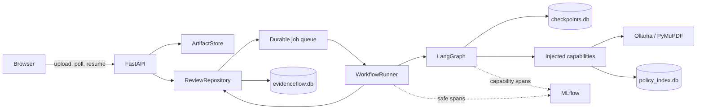

# EvidenceFlow architecture

This is the technical reference for EvidenceFlow V1. The system is deliberately
local and synthetic-only, but its review state, human decisions, and recovery
path are durable.

The central rule is:

> **Models interpret documents and write narrative. Deterministic code owns
> validation, review routing, findings, canonical identity, and final status.**

LangGraph coordinates the bounded state machine, LangChain adapts local Ollama
models, and EvidenceFlow's Pydantic contracts and rule code define domain truth.
Graph state contains JSON-serializable domain data, never model clients,
credentials, database connections, or PyMuPDF objects.

## End-to-end flow

1. The upload route validates the complete one-to-five-PDF bundle. Accepted
   bytes are written through `ArtifactStore` under generated IDs; filenames do
   not become storage paths.
2. `ReviewRepository.create` writes the review, document metadata, initial
   `start` job, and audit event in one immediate SQLite transaction. The API
   returns `202 processing` and wakes the worker.
3. `WorkflowRunner` claims one job and invokes the graph with the review's
   stable `thread_id`. LangGraph checkpoints state between graph steps.
4. The graph may complete or interrupt for classification, field, or conflict
   review. The runner persists the business snapshot and pending items at an
   interrupt, or the validated JSON/Markdown report at completion.
5. The browser observes business state and checkpoint-derived progress through
   the review endpoint. It submits a complete decision batch when required.

The queue runs one review job at a time. Within a job, document processing,
classification, and extraction fan out with `asyncio.gather`. Each classifier
or extractor call receives one document and no chat history, so model context
does not accumulate across documents or evaluation bundles.

## Composition and capability ports

[`app/bootstrap.py`](../app/bootstrap.py) is the runtime composition root. It
loads typed settings/rules, migrates business storage, creates the adapters,
opens the strict checkpoint saver, compiles the graph with
`WorkflowDependencies`, and starts the worker. Indexing and evaluation commands
compose the same ports separately.

The interfaces in [`app/ports.py`](../app/ports.py) are structural Python
`Protocol` ports:

| Port | Contract and V1 responsibility |
| --- | --- |
| `DocumentProcessor` | `UploadedDocument` → ordered, one-based `ProcessedDocument`; `PyMuPDFDocumentProcessor` rejects corrupt, repaired, encrypted, over-limit, or effectively textless PDFs and performs no OCR. |
| `DocumentClassifier` | `ProcessedDocument` → raw `DocumentClassification`; `LLMDocumentClassifier` proposes one of five types with confidence/reasoning, while later code owns review thresholds and overrides. |
| `FieldExtractor` | document + resolved type → typed `ExtractionResult`; `LLMFieldExtractor` returns only allowed fields with confidence and exact page evidence, without normalizing or comparing documents. |
| `ReportComposer` | sealed `VerifiedReview` + `PolicyEvidence` → `ReviewReport`; `LLMReportComposer` authors narrative only, while code validates references and supplies identity/status. |
| `EmbeddingProvider` | text/query → finite fixed-size vectors; `LangChainEmbeddingProvider` validates vector count, dimensions, and values. |
| `PolicyRetriever` | query + limit → ranked domain evidence; `SqliteVecPolicyRetriever` hides sqlite-vec mechanics and index compatibility checks. |
| `ReviewRepository` | business aggregate, decisions, reports, and jobs ↔ durable records; `SQLiteReviewRepository` owns resume concurrency and the local queue, not graph checkpoints. |
| `ArtifactStore` | IDs + bytes ↔ opaque artifact IDs; `LocalArtifactStore` owns containment-safe atomic filesystem access. Current exports stream persisted report state. |

This ports-and-adapters direction lets model providers, PDF processors, vector
stores, relational storage, or object storage change without moving business
rules into infrastructure code. Model-free tests use fakes with the same method
shapes.

## LangGraph nodes and checkpoints

A LangGraph node is a named function that reads
[`ReviewState`](../app/graph/state.py) and returns a partial state update. It is
not an agent or necessarily an AI call. Nodes receive capabilities through
injection and never write the business repository directly.

| Stage | Nodes and ownership |
| --- | --- |
| Process | `process_documents` calls `DocumentProcessor`. |
| Classify | `classify_documents` calls the classifier; `prepare_classification_review` deterministically applies the `<0.70` threshold. |
| Classification review | `human_review` interrupts; `apply_classification` stores an approved/corrected effective type without replacing the proposal. |
| Extract | `extract_fields` calls the type-specific extractor; `unknown` returns an empty typed result without a model call. |
| Completeness | `normalize_and_check_completeness` builds effective values and missing-evidence findings; `prepare_field_review` applies the non-null `<0.75` threshold. |
| Field review | `human_review` → `apply_field` → `revalidate_completeness`. |
| Cross-check | `cross_check` compares every eligible value, including duplicates; `prepare_conflict_review` groups disagreements. |
| Conflict review | `human_review` → `apply_conflict` → `revalidate_after_conflict`; a reviewer selects cited evidence, corrects the value, or leaves it unresolved. |
| Policy/report | `retrieve_policy_evidence` de-duplicates ranked evidence; `compose_report` seals truth, requests narrative, validates references, renders Markdown, and completes state. |

`human_review` is shared; `review_stage` routes the resumed batch to the correct
apply node. Every continuation uses the same `thread_id` and
`Command(resume={"decisions": [...]})`.

The graph uses `AsyncSqliteSaver` in `data/checkpoints.db` with
`JsonPlusSerializer(pickle_fallback=False)`. Checkpoints are fine-grained engine
continuation state. The business snapshot is the API/audit projection persisted
after an interrupt or completed invocation. While processing, the poll endpoint
also reads the latest checkpoint to expose the current stage.

## Model-to-domain boundary

Classification, extraction, and reporting have independently configured chat
models. [`invoke_structured`](../app/ai/structured.py) requests JSON-schema
output, validates a Pydantic schema and capability invariants, and allows exactly
one repair attempt. Provider failures and invalid structured output become
typed errors; there is no agent loop.

Raw classifications and extractions are preserved unchanged by review
application. Corrections populate an effective type or `EffectiveFieldValue`
carrying original/effective values,
normalized forms, evidence, value source, and decision ID. Non-null extracted
fields require exact one-based page evidence. Deterministic code then checks
required material, canonicalizes names/registration numbers, compares revenue
with decimal symmetric tolerance, requires exact employee counts, and includes
all duplicates.

Before reporting, code builds a sealed `VerifiedReview` and derives company
identity/status. Missing required evidence yields `incomplete`; other unresolved
findings yield `needs_follow_up`; otherwise status is `complete`. The reporting
schema exposes only executive summary and sections. Unknown finding or policy
IDs are rejected, and `finalize_report` supplies code-owned identity/status.

## Human-review durability

Review actions are deliberately narrow:

| Trigger | Allowed actions |
| --- | --- |
| classification confidence `<0.70` | approve or correct type |
| non-null field confidence `<0.75` | approve or provide typed correction |
| deterministic conflict | select a cited field, provide typed correction, or mark unresolved |

The API requires exactly one valid decision for every currently pending item.
`SQLiteReviewRepository.begin_resume` uses `BEGIN IMMEDIATE` to recheck
`needs_review`, compare pending/provided ID sets, insert immutable decisions,
mark items decided, transition to `processing`, increment the resume count, and
enqueue the continuation in one transaction. Concurrent/repeated resumes return
`409` rather than applying twice.

On resume, the graph creates `ReviewDecisionAudit` records containing original
and effective values. It changes only the effective layer, then re-runs
completeness or conflict validation. Marking a conflict unresolved preserves an
actionable finding; it yields `needs_follow_up` unless missing required evidence
makes `incomplete` take precedence.

## Persistence and recovery

| Store | Responsibility |
| --- | --- |
| `evidenceflow.db` | reviews/documents, business status/revision, pending items, decisions, reports, events, jobs |
| `checkpoints.db` | LangGraph thread state and continuation |
| `policy_index.db` | canonical policy chunks, vectors, embedded manifest |
| policy manifest JSON | derived human-readable mirror |
| `data/uploads/` | review-owned source PDFs |
| MLflow DB/artifacts | optional telemetry |

The repository applies numbered migrations, foreign keys, WAL, and a busy
timeout. Aggregate reads use one transaction; business revision is separate
from checkpoint identity.

At startup, jobs left `running` become queued `recover` jobs. The runner inspects
the checkpoint and either resumes matching decisions, continues from durable
state, or reconstructs initial input from stored documents. A crash before a
node checkpoint may repeat a model call or trace span. Because nodes do not
mutate business storage, replay cannot insert a second decision or independently
transition status. This is durable local execution, not exactly-once distributed
processing.

## Policy-index identity and invalidation

Policies are report evidence; [`config/review_rules.yaml`](../config/review_rules.yaml)
and Python remain the rules engine. Markdown policies have stable front-matter
IDs and numeric section IDs. Deterministic chunking preserves section metadata
and produces IDs such as `EFP-FINANCIAL:2.2:chunk-0`.

The canonical SQLite index embeds a strict manifest containing build/index
version, embedding provider/model/digest/dimensions, preprocessing and chunk
settings, corpus SHA-256, counts, and timestamp. The retriever opens it
read-only, verifies manifest identity and row counts, optionally re-hashes the
current corpus, and keeps that validated file generation open. Existing readers
therefore remain pinned if a rebuild replaces the path.

Rebuild writes and flushes a temporary database, runs `PRAGMA quick_check`,
validates metadata/counts, then uses a short advisory lock and atomic
`os.replace`. The database is the commit point; the JSON mirror is best effort
and can be repaired from embedded metadata.

Rebuild after policy content, embedder identity/digest/dimensions,
preprocessing, or chunk-setting changes. Chat-model or deterministic-rule
changes do not invalidate existing policy vectors.

## Configuration and preparation boundary

[`config/models.yaml`](../config/models.yaml) is the canonical configuration for each
AI task's provider, model identity, digest, default endpoint, and task-specific
settings. Model selection is not duplicated in `.env`. Environment variables and the
optional ignored `.env` are limited to operational settings such as local paths,
limits, telemetry, and future provider secrets.

Before startup, one preparation flow validates typed configuration, writable storage,
implemented provider adapters, provider connectivity, task model availability and
digests, and policy-index compatibility. Critical checks fail startup with a safe
diagnostic. MLflow availability is a warning for the interactive runtime because
tracing is fail-open; evaluation separately requires tracing to remain healthy and
fails closed.

V1 implements only the Ollama provider adapter. A future cloud adapter would add its
own readiness checker: model/deployment identity would remain in `models.yaml`, while
credentials would come from the environment or a secret store. The checker would
validate authentication and deployment access without returning credential values in
logs or errors.

## MLflow semantics

MLflow sits behind `Tracer`/`Span` protocols. Runtime spans cover
`workflow.execute`, document processing, classification, extraction, retrieval,
and reporting. They record safe identity/count/latency/token metadata, not PDF
text, prompts, or excerpts.

Runtime tracing is fail-open: span failures mark health degraded and latch
`ever_failed`, but safe wrappers let the review continue. Evaluation is
fail-closed: it checks availability and the failure latch so telemetry loss
invalidates the benchmark even if predictions were produced.

## Short polling and long-polling trade-off

The API maps internal nodes to seven stable public stages with
`completed/current/upcoming` states. The browser requests review state 1.5
seconds after each processing response, re-renders only on visible changes, and
announces only real transitions. No percentage or ETA is invented.

Correct long polling cannot wait only on business revision: node progress
advances checkpoint identity before the business row necessarily changes. A
robust design would use an opaque token spanning both versions, check it before
sleeping, wait a bounded 20–25 seconds, notify after checkpoint/business commits,
return a heartbeat on timeout, and have one cancellable client request with
retry/backoff. The checkpoint saver would need a notification hook; polling
SQLite inside a held request is still long polling but does not reduce database
reads. Multi-process deployment would additionally require shared pub/sub or a
durable change stream.

V1 keeps short polling because it is simple and adequate for the small local
bundles. A slimmer progress response or conditional request is a smaller first
optimization. Long polling and server-sent events remain documented options,
not implemented capabilities.
